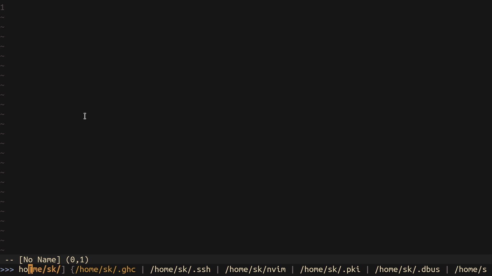
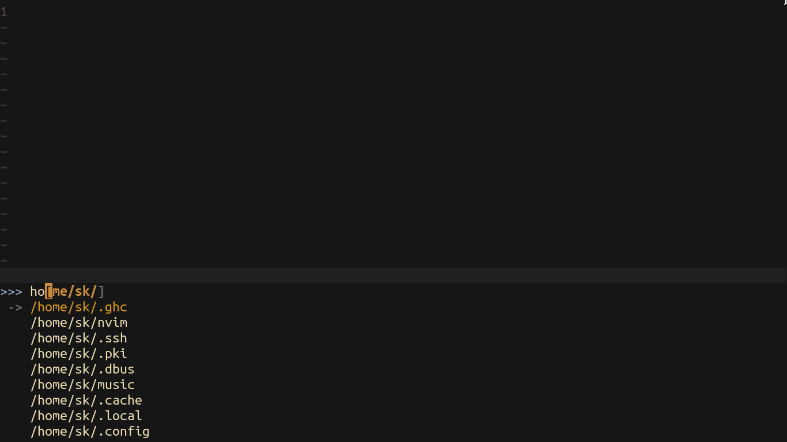
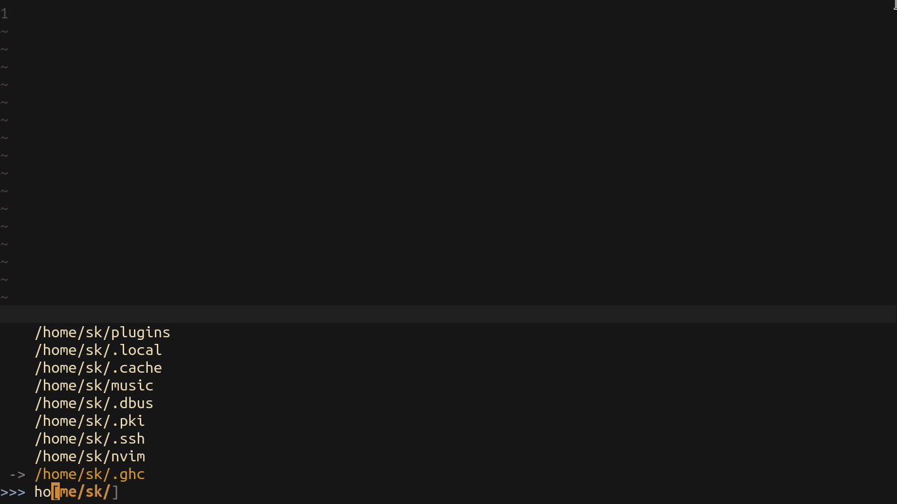

# Layouts
This document will describe how layouts are created, with lots and lots of examples.

Before reading this, it is advised to read the [layouts api](layout.md) document first.

## Default
Let's take a look at the default layout, shall we?

```lua
layout.default = {

   results_start = "{",
   results_selected = "",
   results_separator = " | ",
   results_end = "}",

   suggest_start = "[",
   suggest_end = "]",

   maximum_height = 1,
   dynamic_resize = false,

   render_sequence = {
      "prompt",
      "query",
      "results",
   }

}
```



## Vertical
Sometimes seeing all the results in a single line can be hard on the brain. In that case, one might prefer a more traditional vertical layout. Let's create it then!

```lua
layout.new{

   name = "vertical",

   results_start = "",
   results_selected = "\n -> ",
   results_separator = "\n    ",
   results_end = "",

   maximum_height = 10,
}
```



## Reverse
Perhaps you have wondered what is the purpose of the `render_sequence` option. Well, it is useful in cases like this

```lua
layout.new{
   name = "reverse",

   results_start = "    ",
   results_selected = "\n -> ",
   results_separator = "\n    ",
   results_end = "\n",

   maximum_height = 10,
   dynamic_resize = true,

   render_sequence = {
      {"results", reverse = true, lines_limit = 9},
      "prompt",
      "query",
   }
}
```

Okay, but what does that look like?



### `render_sequence`
This variable dictates in which order the "tokens" of Ido will be rendered. There is a total of 3 tokens:

| Token | Description |
| ----- | ----------- |
| `prompt` | The prompt of Ido |
| `query` | A collection token of the query, the cursor and the suggestion |
| `results` | The results. This token can be passed in two ways, as a `string` and as a `table` |

| Results type | Description |
| ------------ | ----------- |
| `string` | Use the results token as it is |
| `table` | Pass options to the results token. There are 2 options as of now |

| Results options | Description |
| --------------- | ----------- |
| `reverse` | Display the results in a reverse order |
| `lines_limit` | The number of lines to limit the results to |
