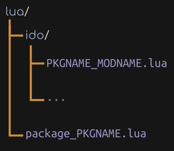

# Packages
A package is a collection of one or more [Ido modules](ex_module.md). This document will guide you through creating your first package.

## Setup
- Create a new neovim plugin, for example `test` (I suck at giving names lol)

```console
$ cd ~/.config/nvim/plugins
$ mkdir -p test/lua/ido
$ cd test/lua
```

- Create the package description file, whose name is of the format `package_NAME.lua`

```console
$ touch package_test.lua
```

- Load the plugin using your favourite plugin manager

```vim
Plug '~/.config/nvim/plugins/test'
```

- Ready. Set. Go!

## Directory structure


## `ido/PKGNAME_MODNAME.lua`
Let's create a module for the package.

- Create a new file, whose name is of the format `PKGNAME_MODNAME.lua`

```console
$ touch ido/test_ls.lua
```

Here the package name is `test` and the module name is `ls`, so the file name is `test_ls.lua`

- [Create the module](ex_module.md)

```lua
-- @file ido/test_ls.lua

local ls = {}

ls.settings = {
   opts = ""
}

function ls.main()
   print(ido.start{
      items = vim.fn.systemlist("ls "..ls.settings.opts.." $HOME")
   })
end

return ls
```

## `package_PKGNAME.lua`
This is the package specification. Think of this like `cargo.toml` or `Makefile` or `package.json`.

- Create the package specification

```console
$ touch package_test.lua
```

```lua
-- @file package_test.lua

local package = require("ido.package")

package.new{
   name = "test",

   modules = {
      "ls",
   }
}
```

The `package.new` function takes a table of options as an argument.

Fields:
- `name` The name of the package

- `modules` The list of modules present in the package

## Load the package
The moment of truth. Let's load the package using either `package.setup()` or `ido.setup()`

- Using `ido.setup()`

```lua
-- @file init.lua

local ido = require("ido")

ido.setup{
   packages = {
      test = {}
   }
}
```

- Using `package.setup()`

```lua
-- @file init.lua

local package = require("ido.package")

package.setup{
   test = {}
}
```

- Run the package by the module naming scheme of `PKGNAME/MODNAME`

```vim
:lua require("ido").module.run("test.ls")
```

- Customize the package from within `init.lua` by using either of the setup functions

```lua
-- @file init.lua

local ido = require("ido")

ido.setup{
   packages = {
      test = {

         -- The name of the module in the package `test` you want to customize
         ls = {

            -- The customizations
            settings = {
               opts = "-A"
            }
         }
      }
   }
}
```

- Enjoy!
