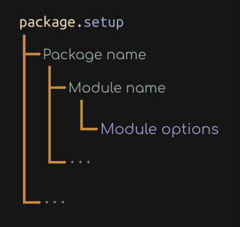

# Packages
A package in Ido is defined as a collection of Ido [modules](module.md).

## `package.new(OPTIONS)`
Registers a new package. It is supposed to be called in the `packages_NAME.lua` file in the root directory of the Ido extension.

It takes a table of options as an argument

Fields:
- `name` The name of the package

- `modules` The modules of the package

Returns:
- `nil` if errors were encountered, in which case it will print the cause

- `true` success

## `package.setup(PACKAGES)`
This is the setup function for the packages. It does the following:

- Loop through every single key in the `PACKAGES` table

- Checks if there is a loaded lua file called `package_NAME.lua`

- Loads the file

It takes a table of packages as an argument, where the key is the package name and the value is the table of options which specify the setup of the package. The values of the `PACKAGES` table are also tables. Their keys are the names of the modules, and their values are the table of options supplied to `module.load()`. Each package in the `PACKAGES` table can also take a module named `global`, which contains the module settings applied to every single module in that package.

It takes a table of packages as an argument, as illustrated in the image above

Returns:
- `nil` if errors were encountered, in which case it will print the cause

- `true` success

## Examples
This document is not for understanding the packages system in Ido. It is merely a reference point for the packages API. To understand modules, see the [examples](ex_package.md)
